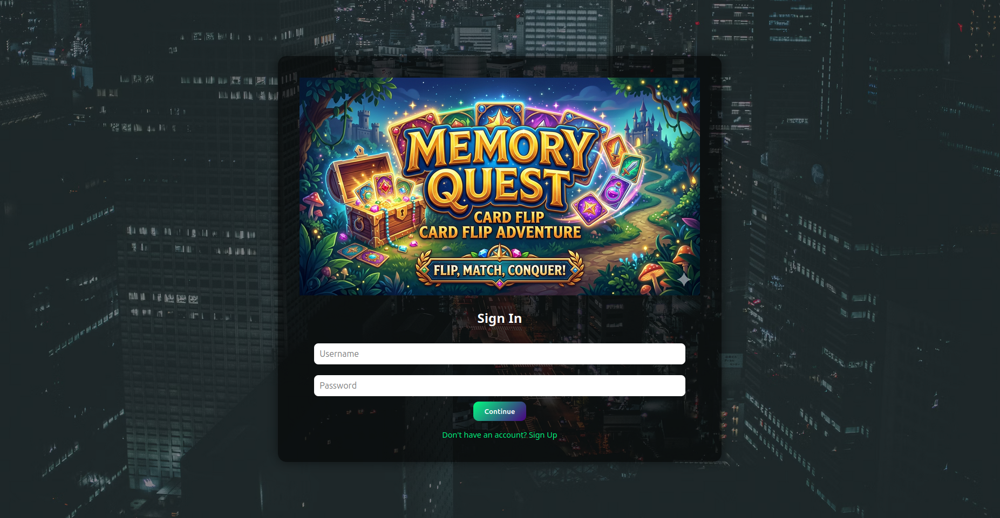
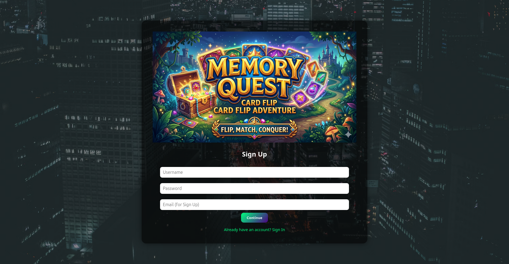
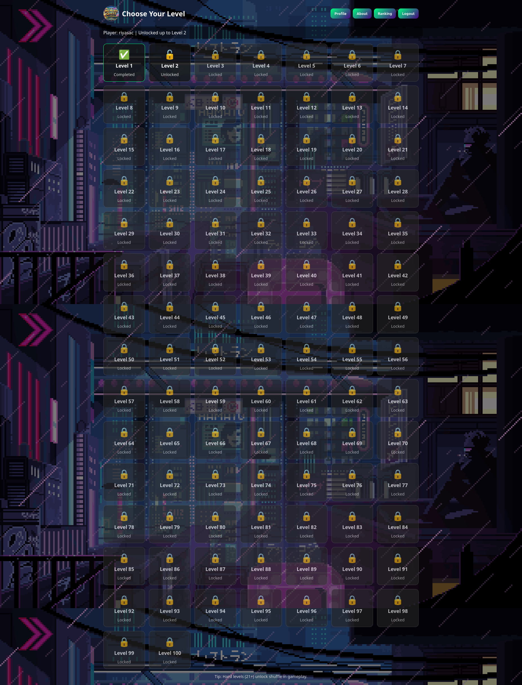
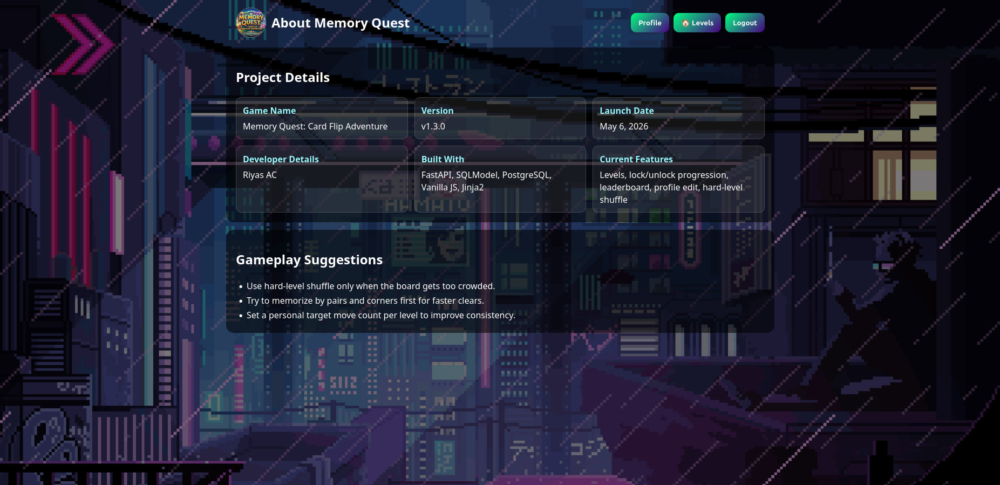
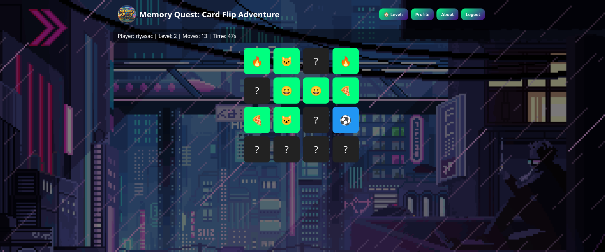
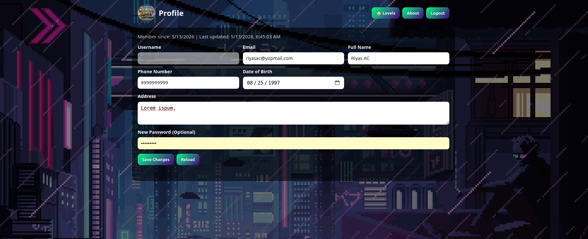

# Memory Quest: Card Flip Adventure

Memory Quest is a FastAPI-powered memory game with JWT authentication, persistent level progression, player profiles, and a leaderboard. The app uses Jinja2 templates for the UI, vanilla JavaScript for gameplay, SQLModel for persistence, and PostgreSQL for storage.

## Project Details

- **Game name:** Memory Quest: Card Flip Adventure
- **Version:** v1.3.0
- **Launch date:** May 6, 2026
- **Developer:** Riyas AC
- **Built with:** FastAPI, SQLModel, PostgreSQL, Vanilla JS, and Jinja2

## Features

- Sign up and sign in with JWT bearer authentication.
- Hash passwords with Argon2 before storing them.
- Play a level-based memory match game with persistent board state.
- Track moves, timer, matched cards, and in-progress sessions.
- Unlock levels sequentially from 1 to 100.
- Show locked, completed, and in-progress states on the level screen.
- Shuffle unmatched cards on hard levels only (`21+`).
- Save per-level highscores in the browser.
- Display a leaderboard ranked by best completed level, moves, and time.
- Edit user profile details from the app.
- Manage `heroes` and `teams` through CRUD endpoints.
- Use FastAPI's built-in Swagger UI and ReDoc docs.

## Gameplay Details

- Flip cards two at a time to find matching pairs.
- The timer starts on the first card flip.
- A game is stored in the database, so unfinished levels can be resumed.
- The backend marks a level complete once every card is matched.
- The leaderboard only considers completed games.
- The level picker and gameplay UI are rendered server-side and enhanced with browser-side JavaScript.

### Level Bands

The deck composition changes with difficulty:

- **Levels 1–10:** 8 pairs using letters or emojis
- **Levels 11–20:** 18 pairs using numbers or symbols
- **Levels 21–30:** 32 pairs using a mixed symbol set
- **Levels 31–40:** 50 pairs using a larger mixed set
- **Levels 41–50:** 72 pairs using the widest mixed set
- **Levels 51–100:** current fallback deck of 8 pairs

## App Pages

- `/login` — sign in / sign up screen
- `/game/levels` — level selection screen
- `/game/` — gameplay screen
- `/game/profile` — profile editor
- `/game/about` — project details page
- `/game/ranks` — leaderboard

## API Overview

### Auth and Users

- `POST /token` — obtain a JWT access token
- `POST /users/` — create a user account
- `GET /users/me` — fetch the current profile
- `PATCH /users/me` — update the current profile
- `GET /users/` — paginated user listing
- `GET /users/{user_id}` — fetch a user by ID
- `PUT /users/{user_id}` — update a user by ID
- `DELETE /users/{user_id}` — delete a user by ID

### Game

- `POST /game/start` — start or resume a level
- `POST /game/flip` — reveal a card
- `POST /game/check` — compare two revealed cards
- `POST /game/shuffle` — reshuffle unmatched cards on hard levels
- `GET /game/state` — fetch the current saved game state
- `GET /game/levels/status` — get locked / completed / in-progress levels
- `GET /game/leaderboard` — get ranked player results

### Demo Resources

- `POST /heroes/`, `GET /heroes/`, `PUT /heroes/{hero_id}`, `DELETE /heroes/{hero_id}`
- `POST /teams/`, `GET /teams/`, `PUT /teams/{team_id}`, `DELETE /teams/{team_id}`

## Tech Stack

- **Backend:** FastAPI, SQLModel, async SQLAlchemy, psycopg
- **Auth:** OAuth2 password flow, JWT, Argon2
- **Frontend:** Jinja2, HTML, CSS, Vanilla JavaScript
- **Database:** PostgreSQL
- **Tooling:** Docker, Docker Compose, uv

## Running Locally

### With Docker

```bash
docker compose up -d
```

This starts PostgreSQL, the FastAPI backend, and Adminer.

### With `uv`

```bash
uv sync
uv run uvicorn main:app --reload --host 0.0.0.0 --port 8000
```

Make sure PostgreSQL is available and set the environment variables you need, especially:

- `DATABASE_URL` — defaults to `postgresql+psycopg_async://postgres:postgres@db/maindb`
- `SECRET_KEY` — used for JWT signing

## Project Structure

```text
.
├── main.py
├── routers/
│   ├── game_router.py
│   ├── hero_router.py
│   ├── team_router.py
│   └── user_router.py
├── models/
├── schemas/
├── dependencies/
├── services/
├── utils/
├── templates/
├── static/
├── Dockerfile
├── docker-compose.yml
├── pyproject.toml
└── uv.lock
```

## Notes

- The app auto-creates database tables on startup.
- Game progress is stored server-side, while timer/highscore helpers use browser storage.
- Hard levels expose shuffle only for unmatched cards, so completed pairs stay locked in place.

# Screen shots

### 1. Login Page


### 2. Signup Page


### 3. Levels Page


### 4. About Page


### 5. Game Page


### 6. Profile Page

